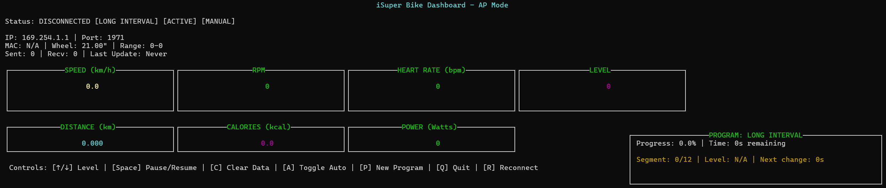
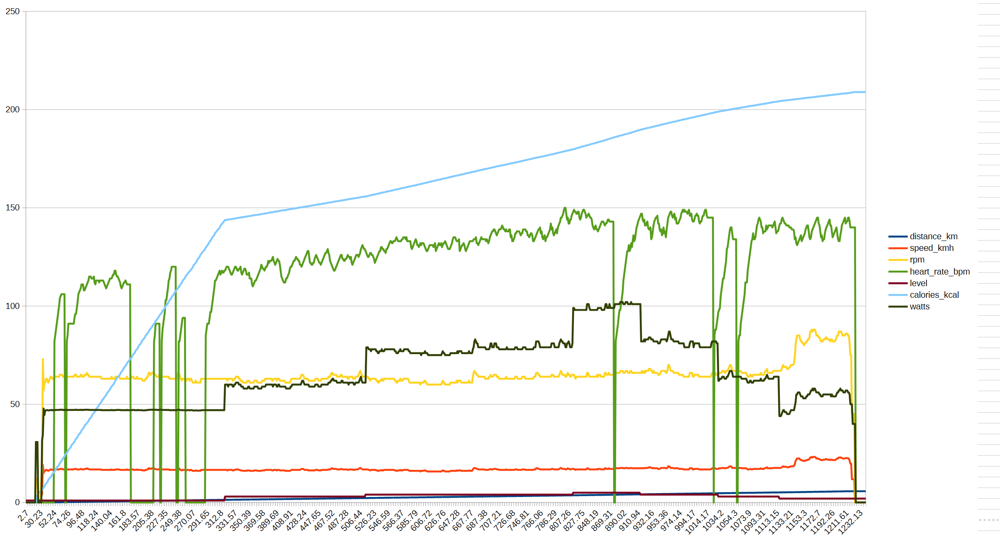

# iSuper Bike Dashboard



A Python-based dashboard and client for iSuper gym bikes. This project implements a reverse-engineered custom ASCII protocol to connect to gym bikes via WiFi, providing real-time monitoring, control, and structured workout programs through an elegant terminal-based interface.



## Features

- **Real-time Monitoring**: Live display of speed, RPM, heart rate, power, distance, and calories
- **Terminal Dashboard**: Clean curses-based UI with color-coded metrics and gauges
- **Workout Programs**: Structured interval training with customizable resistance profiles
- **Manual Control**: Adjust resistance levels on the fly with keyboard shortcuts
- **Data Logging**: Automatic CSV export of all workout sessions to `activity_logs/`
- **Dual WiFi Modes**: Support for both P2P (direct) and AP (router) connection modes

## Quick Start

### Prerequisites

```bash
# Windows
pip install windows-curses

# Linux/macOS (curses usually pre-installed)
# No additional packages needed
```

### Connect and Run

```bash
# Scan for bikes on your network
python dashboard.py --list-ips

# Connect to your bike (adjust IP as needed)
python dashboard.py --ip 169.254.1.1

# Enable debug logging for troubleshooting
python dashboard.py --ip 169.254.1.1 --debug
```

## Usage

### Connection Modes

**P2P Mode (Direct Connection)**
- Bike creates its own WiFi network (e.g., "iSuper Bike", "Bike_XXXXXX")
- Connect your computer to the bike's WiFi
- Default IP: `169.254.1.1`
- Ideal for quick, direct connections

**AP Mode (Router Connection)**
- Bike connects to your existing WiFi router
- Both devices on the same network
- Bike IP varies (check bike's display or scan with `--list-ips`)
- Configure via: `python dashboard.py --configure-ap <SSID>`

### Dashboard Controls

| Key | Action |
|-----|--------|
| `↑` / `↓` | Increase/Decrease resistance level |
| `Space` | Pause/Resume sport mode |
| `X` | Clear all data (reset distance) |
| `A` | Toggle auto-update mode |
| `P` | Select new workout program |
| `R` | Reconnect to bike |
| `Q` | Quit dashboard |

### Workout Programs

The dashboard includes pre-configured workout programs for different training goals:

- **Warmup** - Gradual warm-up progression
- **Intervals** - High-intensity interval training
- **Long Interval** - Extended interval sessions
- **Endurance** - Steady-state endurance rides
- **Pyramid** - Progressive intensity pyramid

When starting a program, you can specify the duration (default: 30 minutes). The dashboard will automatically adjust resistance according to the program's defined segments.

### Creating Custom Programs

Create a new `.txt` file in the `sport_programs/` directory:

```
//Define number of segments : SEG:[NUMBER]
SEGMENTS:4
//Set difficulty/level changes (Applies at the beginning of the segment): SEG:[Startofsegment]:[level]
SEG:1:3
SEG:2:5
SEG:3:7
SEG:4:5
END
```

- `SEGMENTS:N` - Total number of equal-length segments
- `SEG:X:Y` - At segment X, change resistance to level Y
- Levels must be within your bike's resistance range (typically 1-20)

## Architecture

### Protocol Implementation

The project implements the iSuper bike's proprietary ASCII-based protocol over TCP port 1971:

- **Connection**: TCP socket to bike on port 1971
- **Authentication**: Hardcoded password `"SUPERWIGH"`
- **Polling**: Data requests every 200ms via `<WB_6>`
- **Sport Data**: `<W6_SYNC,DISTANCE,RPM,PULSE,LEVEL,CALORIES,POWER,UNKNOWN>`

### Core Components

- **[isuper_bike.py](isuper_bike.py)** - Protocol client handling connection, initialization, and data parsing
- **[dashboard.py](dashboard.py)** - Terminal UI with curses, keyboard input, and program integration
- **[sport_program_parser.py](sport_program_parser.py)** - Program file parser and workout state management

### Data Logging

All workout sessions are automatically logged to CSV files:

```
activity_logs/workout_YYYYMMDD_HHMMSS_[program_name].csv
```

Columns include:
- Timestamp
- Elapsed seconds
- Distance (km)
- Speed (km/h)
- RPM
- Heart rate (bpm)
- Resistance level
- Calories (kcal)
- Power (watts)

## Troubleshooting

### Connection Issues

**"Connection timeout"**
- Verify you're connected to the correct WiFi network (P2P mode: bike's WiFi, AP mode: your router)
- Check if bike is powered on
- Try scanning with `--list-ips` to find correct IP

**"No bikes found"**
- Ensure bike and computer are on the same network
- Check bike's WiFi settings in AP mode
- Try cycling bike power

**Data not updating**
- Press `Space` to ensure sport mode is active
- Press `R` to reconnect if connection dropped
- Check if bike is in standby mode

### Known Limitations

- Distance counter wraps around at 1000; client handles this automatically
- Resistance level range varies by bike model (typically 1-20)
- Heart rate monitor requires compatible chest strap or hand sensors
- Windows requires `windows-curses` package for terminal UI

## Documentation

- **[ISUPER_BIKE_PROTOCOL.md](ISUPER_BIKE_PROTOCOL.md)** - Complete protocol specification and reverse-engineering details
- **[BIKE_DASHBOARD_README.md](BIKE_DASHBOARD_README.md)** - Original documentation and examples

## Contributing

Contributions are welcome! Areas for improvement:

- Additional workout program templates
- Data visualization tools for CSV logs
- Mobile UI alternative
- Bluetooth LE support (if available)
- Heart rate zone training features

## License

This project is provided as-is for educational and personal use. The iSuper bike protocol was reverse-engineered from the official Android app.

## Acknowledgments

Developed by reverse-engineering the iSuper Fitness 1.1 Android APK. Special thanks to the open-source community for protocol analysis tools and documentation.

---

**Note**: This software is not affiliated with or endorsed by iSuper Fitness. Use at your own risk.
